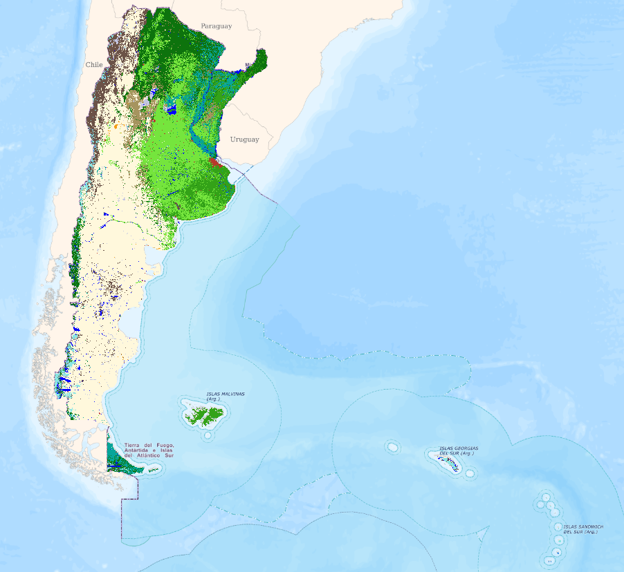

# Mapa Nacional de Cobertura del suelo - Argentina

   

## 📚 Introducción

 **Dirección Nacional de Servicios Geográficos** 
 **Dirección de Información Geoespacial** 
 **Departamento de Aplicaciones Geoespaciales** 

El mapa de cobertura del uso del suelo es un producto creado por el Instituto Geográfico Nacional (IGN) que busca representar una clasificación de cobertura del suelo para el territorio nacional. Por medio de imágenes satelitales ópticas, modelos digitales de elevación (MDE) e imágenes de radar de apertura sintética (SAR, por sus siglas en inglés), se calcularon distintos tipos de índices espectrales, se realizó la clasificación de 11 categorías de uso del suelo, a partir de la utilización del algoritmo Random Forest. En esta versión se trabajo con información del año 2021. 

Las categorías se asignaron teniendo en cuenta productos de cobertura preexistentes y el Catálogo de Objetos Geográficos institucional del IGN. La clasificación se realiza teniendo en cuenta 11 categorías, y luego se agregan 2 categorías: Planta Urbana, que proviene de la Base de datos Geográfica Institucional del IGN y la categoría Glaciar proveniente del Inventario Nacional de Glaciares.

**Categorías:**
1. Cuerpos de Agua 
2. Nieve 
3. Bosque, selva 
4. Estapa Arbustiva 
5. Tierra para cultivo 
6. Afloramiento rocoso 
7. Humedal
8. Salina
9. Médano, duna
10. Pastizal
11. Monte
12. Planta Urbana*
13. Glaciar*

## ⚙️ Instrucciones

El código de clasificación está disponible tanto en la carpeta scripts dentro de este repositorio GitHub como en el repositorio de GEE. El mismo cuenta con un ejemplo de las muestras para la provincia de San Juan, pudiendo ejecutarse sin necesidad de modificarlo. Recuerde que si usted desea clasificar otra provincia, es necesario tomar las muestras correspondientes a las 11 categorías establecidas en el código, con su correspondiente columna "class", y definir la variable en el apartado de Muestras (línea 316). También es posible modificar el código para clasificar más o menos categorías realizando las modificaciones pertinentes en el script. 

<pre><code> // Muestras (Incorporar shape desde "Assets" o tomar las muestras directamente desde GEE)

var muestras = muestras_sj.filterBounds(area) //Reemplazar "muestras_sj" por el shape con las muestras, donde debera poseer una columna "class" con el número de categoría

var muestras_1 = muestras.randomColumn('random') // A esas muestras se le asigna una columna aleatoria para luego poder dividir en 70/30

Export.table.toDrive(muestras_1, 'Muestras_Exportación')
</code></pre>

## Enlaces 🔗

> [**Enlace al repositorio en Google Earth Engine**](https://code.earthengine.google.com/?accept_repo=users/aplicacionesgeoespaciales/coberturas-uso-del-suelo)

> [**Enlace al mapa en el ArgenMap**](https://mapa.ign.gob.ar/?zoom=4&lat=-40&lng=-59&layers=argenmap,cobertura#)
